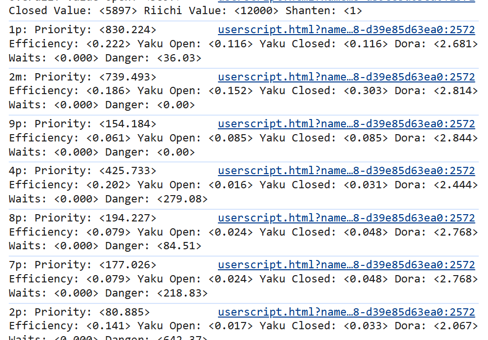
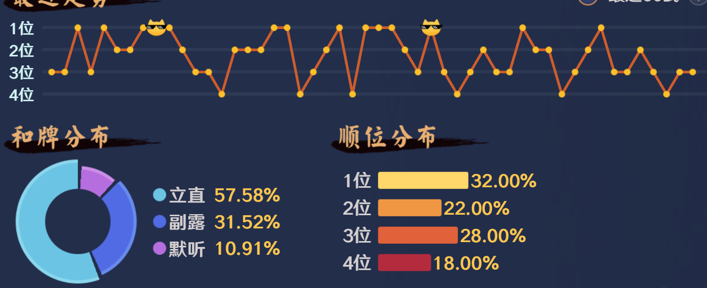

# DoJot 1.0.0 使用流程

## 项目简介

`DoJot` 是一个面向雀魂对局的 AI 脚本项目，支持：

- 使用可导入参数配置控制策略行为
- 自动采集并导出对局统计数据（gameData）
- 通过高斯过程回归（GPR）贝叶斯优化器生成下一组参数
- 人工导入新参数后继续迭代优化
- 使用F12查看具体参数（AI的逻辑还是蛮变态的）

---

## 目录说明

- `DoJot_1.0.0.user.js`：主脚本（Tampermonkey/Greasemonkey）
- `Parameter/defaultParameter.importable.json`：参数导入模板
- `Parameter/defaultParameter.json`：参数边界和类型定义
- `GameData/`：导出的对局数据
- `Optimizer/BayesianOptimizer.py`：离线贝叶斯优化器（GPR + EI，支持耦合分组与锚点正则）
- `Optimizer/parameter_coupling.json`：参数耦合分组定义（与 `defaultParameter.json` 中的可调项一一对应）
- `Optimizer/suggestedParameter.importable.json`：优化器默认输出路径（可用 `--out` 修改）

---

## 环境准备

1. 浏览器安装用户脚本插件（如 Tampermonkey）
2. 安装 Python 3.9+（建议 3.10/3.11）
3. 安装依赖包：

```bash
pip install numpy scipy scikit-learn
```

---

## 日常使用流程（推荐）

1. **加载脚本**
   
   - 将 `DoJot_1.0.0.user.js` 导入用户脚本管理器并启用

2. **导入参数**
   
   - 在脚本界面导入 `Parameter/defaultParameter.importable.json`
   - 或导入上一次优化输出的参数文件

3. **运行对局并收集数据**
   
   - 正常自动对局
   - 脚本会持续记录每场大局统计（本地存储）

4. **导出 gameData**
   
   - 导出到 `GameData/` 目录（示例：`gameData_YYYYMMDDHHmmss.json`）

5. **运行优化器**

在项目根目录执行（将 `gameData` 换成你刚导出的文件名）：

```bash
python Optimizer/BayesianOptimizer.py --game-data GameData/你的导出文件.json
```

**推荐**（小样本时更稳：耦合局部搜索 + 锚在初版参数上）：

```bash
python Optimizer/BayesianOptimizer.py ^
  --game-data GameData/你的导出文件.json ^
  --template Parameter/defaultParameter.importable.json ^
  --out Optimizer/suggestedParameter.importable.json ^
  --anchor-weight 0.12 ^
  --block-mutation-ratio 0.6 ^
  --candidates 4000 ^
  --seed 42
```

多行续行：Linux / macOS 用行末 `\`；Windows **cmd** 用行末 `^`；**PowerShell** 用行末反引号 `` ` ``。

6. **获取新参数**
   
   - 生成文件：`Optimizer/suggestedParameter.importable.json`
   - 在脚本中手动导入该文件继续下一轮对局

7. **循环迭代**
   
   - 重复“对局 -> 导出 -> 优化 -> 导入”流程

---

## BayesianOptimizer 使用方法

### 依赖与运行位置

- 依赖：`numpy`、`scipy`、`scikit-learn`（见上文「环境准备」）
- 请在 **仓库根目录** 运行命令，以便默认路径 `Parameter/`、`Optimizer/`、`GameData/` 正确解析。

### 完整命令行参数

| 参数 | 默认值 | 说明 |
|------|--------|------|
| `--game-data` | `GameData/gameData_20260324135920.json` | 导出的 gameData（含 `records[].metadata.ai_parameters` 与 `overall_statistics`） |
| `--param-spec` | `Parameter/defaultParameter.json` | 可调参数的类型与上下界（与脚本内参数 schema 一致） |
| `--template` | `Parameter/defaultParameter.importable.json` | **合并基准**：输出 = 在此模板上覆盖优化器建议的补丁；同时用作 `--anchor-weight` 的锚点编码 |
| `--out` | `Optimizer/suggestedParameter.importable.json` | 写回完整可导入 JSON |
| `--seed` | `42` | 随机种子（候选点与 GP） |
| `--candidates` | `4000` | 每次提议时随机+局部候选点数量，越大越慢、通常越稳 |
| `--coupling` | `Optimizer/parameter_coupling.json` | 耦合分组文件路径 |
| `--no-coupling` | 关闭 | 不使用分组，局部搜索改为各维独立扰动 |
| `--block-mutation-ratio` | `0.55` | 从历史最优点做局部搜索时，使用「同块相关扰动」的候选占比；其余为传统独立扰动 |
| `--anchor-weight` | `0` | **锚点正则**：在期望改进（EI）上惩罚偏离 `--template`（归一化空间均方差）。`0` 与旧版行为一致；样本少时建议 `0.1~0.2` |
| `--no-ard` | 关闭 | 不使用各维独立 length_scale 的 Matern 核，退化为各向同性核 |
| `--scale-group` | `0.09` | 耦合块内共享扰动的标准差（归一化坐标 0~1） |
| `--scale-independent` | `0.028` | 块扰动之后、每维再叠加的独立噪声标准差 |

### 耦合分组在做什么

脚本里 **SAFETY、DANGER_PENALTY、SAFETY_FACTOR** 等会在同一公式或同一条阈值链上 **相乘/相除**。若优化器只在高维空间里对每一维 **独立** 随机扰动，容易出现 **目标函数上不差、但参数组合极难解释** 的点。`parameter_coupling.json` 把强相关参数划成若干 **块**：在历史高分点附近采样时，**同一块内先共享一步扰动**，再叠加较小的独立噪声，使建议更贴近真实策略结构。

### 标准一行示例

```bash
python Optimizer/BayesianOptimizer.py --game-data GameData/DoJot_gameData_20260403073012.json
```

### 推荐示例（耦合 + 锚点，适合迭代调参）

```bash
python Optimizer/BayesianOptimizer.py \
  --game-data GameData/DoJot_gameData_20260403073012.json \
  --param-spec Parameter/defaultParameter.json \
  --template Parameter/defaultParameter.importable.json \
  --out Optimizer/suggestedParameter.importable.json \
  --anchor-weight 0.12 \
  --block-mutation-ratio 0.6 \
  --candidates 4000 \
  --seed 42
```

### 控制台输出

运行结束后会向 **标准输出** 打印一段 JSON，包含：

- `samples_used` / `samples_skipped`：有效样本与跳过条数
- `best_historical_score`：当前 gameData 里最优目标分
- `best_historical_params_subset` / `suggested_params_subset`：历史最优与 **本轮提议** 的参数子集（嵌套结构）
- `optimizer`：本次是否启用 ARD、锚点权重、耦合文件路径、`coupling_meta`（分组数量、未分组参数列表等）

将 `--template` 设为你信任的初版或上一轮满意配置，再配合 `--anchor-weight`，可减轻「样本很少时建议点飘太远」的问题。

---

## 调优建议

- 先固定参数跑 20+ 局再做一次优化，噪声更小
- 每次只替换一份建议参数，避免多变量来源混杂
- 若行为波动过大，可降低迭代频率并扩大样本数
- 记录每轮参数文件和 gameData，便于回滚与对照
- **样本仍较少（如 &lt;30 局）时**：适当 **提高 `--anchor-weight`**（如 0.15~0.25），并把 `--template` 设为你信任的初版 `importable`
- 若希望某几条决策链单独微调：可编辑 `Optimizer/parameter_coupling.json` 拆/并 `groups`，再跑优化

---

## 故障排查

- **优化器提示样本不足**
  - 检查 `gameData` 是否包含 `records[].metadata.ai_parameters`
- **导入参数后无变化**
  - 检查是否导入了 `importable` 结构 JSON
- **脚本刷新后数据丢失**
  - 检查浏览器是否清理了 `localStorage`

---

## 版本信息

- 项目名：`DoJot`
- 项目版本：`1.0.0`

----

## 效果展示

### 最有定力的兜牌

因为在金之间训练的，金之间最大的特点就是2位加分非常多，3位扣分非常少，总而言之，只要不是4位，一直打下去都是能上分的。

所以为了不掉到4位，兜牌的权重训练以后变的相当高。

比较有代表性的一把：末巡拒听两次一气通贯


看看总牌河


这是因为我的防守逻辑是选择一名玩家统计其危险值，在认为某个玩家非常危险的时候相当于根据他的牌河单防他。只会打他打过的现物。

来看看日志：



日志里面没有3m 5p，认为这都是危险牌/高价值牌，尽可能不要打出去。

太能兜了我天哪，有这个定力做什么都会成功的（

### 非常高牌效的切牌


一个简单的例子：45779->45579

确实牌效高，确实如果自己打就会顺手打5m，甚至为了碰牌多一点会打9m，如果那么打后面很不舒服了


当然这把奶奶发牌也没有什么影响（

## 一些特殊役种的危险系数很高

比如说大四喜，小四喜，大三元，清一色，混一色，字一色


上家保底混一色自风场风四番满贯，不能点，放铳的输分期望太高了

兜了好久好久的西风北风，这时候AI已经弃胡了，最后没有点炮也算胜利。

### AI打了4天麻将的结果

用AI收集数据打了4天麻将




四麻段位从雀杰1星200分到三星1361分，感觉再挂一晚上能上雀豪啊。

事已至此，先发布吧。
