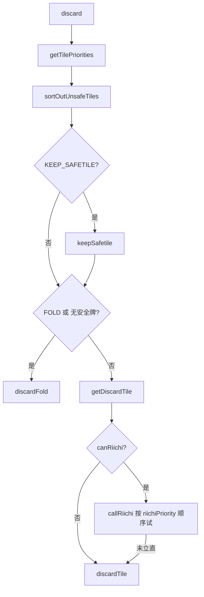

# 切牌决策流程说明

本文档描述 `DoJot_1.0.0.user.js` 中从「轮到切牌」到「最终选择打哪张牌」的完整调用链与不同粒度的计算关系。入口函数为 **`discard()`**。

---

## 1. 最粗粒度：总流程

### 1.1 `discard()` 主逻辑（摘要）

1. `tiles = await getTilePriorities(ownHand)` — 为每张候选切牌生成评估对象（含 `priority`、`danger` 等）。
2. `tiles = sortOutUnsafeTiles(tiles)` — 为每张牌打 `safe` 标志，并按 `safe` 排序（安全优先）。
3. 若 `KEEP_SAFETILE`：`keepSafetile(tiles)` — 在特定条件下把唯一安牌挪到列表末尾，避免打掉。
4. 若 `strategy == STRATEGIES.FOLD` 或没有任何 `safe == 1`：`return discardFold(tiles)` — 进入弃胡/全防分支。
5. 否则：`tile = getDiscardTile(tiles)` — 在已排序列表上决定最终候选（含副露保役覆盖）。
6. 若 `canRiichi()`：将 `tiles` 按 `riichiPriority` 降序排序后调用 `callRiichi(tiles)`；若立直成功则发送立直，**不**再执行 `discardTile(tile)`。
7. 若未立直：`discardTile(tile)` — 实际点击切牌。

**一句话**：先算每张牌的进攻/防守相关指标并排序，再经安全筛选、可选保安牌、弃胡分支、副露保役；最后可能被立直分支截胡；否则执行普通切牌。

---

## 2. 中等粒度：三条决策轴

### 2.1 轴 A — `priority`（进攻综合）从哪来？

| 步骤 | 函数 | 作用 |
|------|------|------|
| 1 | `getTilePriorities(ownHand)` | 按策略分支生成候选列表并排序 |
| 2 | 一般型 | 对每种去重切法：`getHandValues(hand, discardedTile)` |
| 2' | 七对子 | `chiitoitsuPriorities()` |
| 2'' | 国士 | `thirteenOrphansPriorities()` |
| 3 | `applyTileRetentionAdjustment(tiles)` | 可选：按听牌质量扣减 `priority` / `riichiPriority`，并记录 `retention` |
| 4 | `tiles.sort(...)` | 默认按 `priority` 降序；若开启持牌参数且向听相同、priority 差在阈值内，用 `retention` 作次序打破 |

`getHandValues` 末尾将 **效率 `efficiency`、期望点 `expectedScore`、用于公式的危险度 `dangerForPriority`** 合成为 **`priority`**：

- `danger = getTileDanger(discardedTile)`（原始危险度）
- `sakigiri = getSakigiriValue(hand, discardedTile)`（先切修正）
- **`dangerForPriority = danger - sakigiri`**
- **`priority = calculateTilePriority(efficiency, expectedScore, dangerForPriority)`**

若当前已是听牌（`originalShanten == 0`），另算：

- `riichiEfficiency = waits / 10`
- **`riichiPriority = calculateTilePriority(riichiEfficiency, expectedScore, dangerForPriority)`**

返回对象中除 `priority` / `riichiPriority` 外，还包含 `shanten`、`score`、`yaku`、`waits`、`shape`、`danger`、`fu`、`sakigiri`、`dangerForPriority` 等，供日志与其它逻辑使用。

---

### 2.2 轴 B — `danger` 与 `dangerForPriority`

**`getTileDanger(tile)`（自家视角 `playerPerspective = 0`）**

- 对每个对手计算 `getDealInChanceForTileAndPlayer`，再乘 `getExpectedDealInValue(player)`。
- 各对手分量求和为总 `danger`。
- 若 `getCurrentDangerLevel() < 2500`，对 `danger` 做整体缩放（低危局降低防守权重）。

**`getSakigiriValue(hand, tile)`**

- 表示「是否值得先切这张危险牌」的加项；手上对他人而言的安牌越少，先切倾向越大（含庄家加权等）。

**进入 `calculateTilePriority` 的危险项**

- 使用 **`dangerForPriority = danger - sakigiri`**，而不是原始 `danger`。

---

### 2.3 轴 C — `safe` 与 `discardFold`

**`sortOutUnsafeTiles(tiles)`**

- 对每张牌调用 `shouldFold(tile, highestPrio)`（仅当 `tile === tiles[0]` 时 `highestPrio === true`，用于打日志）。
- `shouldFold` 为真 → `tile.safe = 0`，否则 `safe = 1`。
- 再按 `safe` 降序排序（安全牌排在前面）。

**`shouldFold`（摘要）**

- 若向听过远相对剩余牌数：可触发全局弃胡策略。
- 否则比较 **`tile.danger`** 与 **`getFoldThreshold(tile, ownHand)`**（push/fold 多因子表）；超过阈值则视为应弃。

**`discardFold(tiles)`**

1. **混合模式**（尚未 `STRATEGIES.FOLD`）：在满足 **最小向听** 的候选中，寻找 **danger 相对最低张不太远** 且 **低于 fold 阈值×系数** 的切法，优先兼顾形状。
2. **全弃**：将 `tiles` 按 **`danger` 升序** 排序，打 **danger 最低** 的一张。

---

### 2.4 轴 D — `getDiscardTile`（副露保役）

在已通过 `safe` 排序的 `tiles` 上：

- 通常候选为 **`tiles[0].tile`**（安全侧综合排序第一）。
- 若已副露且 `yaku.open` 不足、且未触发「门清 / 剩余牌很少」等例外：在 **`danger <= getFoldThreshold(t, ownHand)`** 约束下，尝试选择 **`yaku.open` 更高** 的切牌，避免无役。

---

### 2.5 轴 E — 立直与最终发送

- **`getDiscardTile` 返回的 `tile`** 表示「普通切牌」意图。
- **`canRiichi()`** 为真时：`tiles` 按 **`riichiPriority`** 重排，`callRiichi` 按此顺序找服务器允许的立直打牌组合；内部 **`shouldRiichi`** 决定是否宣言。
- **立直成功**：`sendRiichiCall`，**不**调用 `discardTile(tile)`。
- **未立直**：`discardTile(tile)` → `callDiscard(index)`。

---

## 3. 最细粒度：`priority` 显式公式（`calculateTilePriorityWithBreakdown`）

逻辑与 `calculateTilePriority` 一致，仅多返回中间量便于日志。

记：

- `baseScore = isClosed ? expectedScore.closed : expectedScore.open`
- `placementFactor`：末局且领先时取参数 `FIRST_PLACE_LAST_GAME_FACTOR`，否则为 `1`
- `exp = WEIGHTED_EFFICIENCY_EXPONENT_BASE + EFFICIENCY * placementFactor`
- `weightedEfficiency = sign(efficiency) * |efficiency|^exp`
- `dangerTerm = danger * DANGER_PENALTY_MULTIPLIER * SAFETY`（此处的 `danger` 即 **`dangerForPriority`**）
- `scoreAfterDanger = baseScore - dangerTerm`

若 `weightedEfficiency < 0`（负效率 / 退向听）：

- `scoreForProduct = NEGATIVE_EFFICIENCY_HOTFIX_BASE_SCORE - scoreAfterDanger`

否则：

- `scoreForProduct = scoreAfterDanger`

**最终：**

\[
\text{priority} = \text{weightedEfficiency} \times \text{scoreForProduct}
\]

**说明**：`priority` 仅在**同一手牌、同一批候选切法**之间相对比较有意义，绝对数值无独立含义（源码注释亦如此说明）。

---

## 4. 更底层：`getHandValues` 与进攻分量

`getHandValues` 通过 **两巡抽牌期望的近似与剪枝**（避免枚举全部牌山组合）聚合得到：

- `shanten`、`efficiency`（非听牌 / 听牌 / 退听等不同分支公式不同）
- `expectedScore`（open / closed / riichi）
- `yaku`、`dora`、`waits`、`shape`、`fu` 等

再与 `dangerForPriority` 合成 `priority` 与（听牌时）`riichiPriority`。若要逐行阅读，请以 **`getHandValues` 函数体** 为入口，跟踪其对组合、向听、得分归一化及 `waits` 修正等子步骤。

---

## 5. 关键函数索引（便于在源码中检索）

| 函数名 | 角色 |
|--------|------|
| `discard` | 切牌总入口 |
| `getTilePriorities` | 生成候选列表、持牌修正、按 priority 排序 |
| `getHandValues` | 一般型单张切法的完整评估 |
| `chiitoitsuPriorities` / `thirteenOrphansPriorities` | 特殊路线候选 |
| `calculateTilePriority` / `calculateTilePriorityWithBreakdown` | priority 合成公式 |
| `getTileDanger` / `getSakigiriValue` | 原始危险度与先切修正 |
| `sortOutUnsafeTiles` / `shouldFold` / `getFoldThreshold` | safe 与弃和阈值 |
| `keepSafetile` | 保留唯一安牌（参数开启时） |
| `discardFold` | 弃胡/全防切牌 |
| `getDiscardTile` | 副露保役覆盖 |
| `canRiichi` / `callRiichi` / `shouldRiichi` | 立直分支 |
| `discardTile` / `callDiscard` | 实际打出 |

---

## 6. 文档与代码同步说明

本文档依据仓库内 `DoJot_1.0.0.user.js` 的逻辑结构整理。若后续重命名函数或调整分支顺序，请以源码为准并酌情更新本节对应关系。
